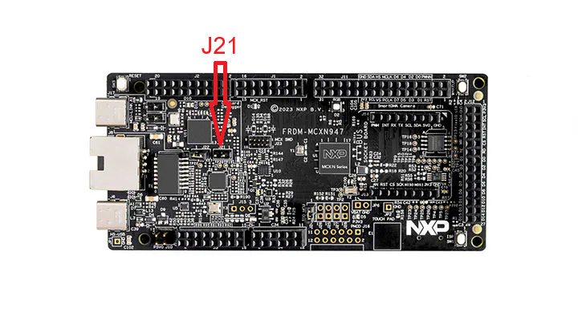

# Building Embedded Products with Zephyr


Webinar presented by **Loïc Domaigné** <br/>
Senior Members Technical Staff, Doulos

Scheduled on: 19<sup>th</sup> March 2025.

## Introduction
This documentation is a companion to the Doulos Webinar [Building Embedded Products with Zephyr](https://www.doulos.com/events/webinars/building-embedded-products-with-zephyr). It is licensed under the Apache License, Version 2.0.

### License

Copyright 2025 by [Doulos](https://www.doulos.com)

Licensed under the Apache License, Version 2.0 (the "License"); you may not use this file except in compliance with the License. You may obtain a copy of the License at:

http://www.apache.org/licenses/LICENSE-2.0

Unless required by applicable law or agreed to in writing, software distributed under the License is distributed on an "AS IS" BASIS, WITHOUT WARRANTIES OR CONDITIONS OF ANY KIND, either express or implied. See the License for the specific language governing permissions and limitations under the License.

## Using Percepio Tracealyzer<sup>:registered:</sup> with NXP MCX N947
*Quae Sunt Caesaris, Caesaris* - Most of the information given here can be found in the excellent [Zephyr Project Documentation](https://docs.zephyrproject.org/latest/index.html).

### Enabling Percepio TraceRecorder
Add the following options to your application `prj.conf`:
```kconfig
CONFIG_TRACING=y
CONFIG_PERCEPIO_TRACERECORDER=y
CONFIG_PERCEPIO_TRC_START_MODE_START_FROM_HOST=y
CONFIG_PERCEPIO_TRC_CFG_STREAM_PORT_RTT=y
CONFIG_PERCEPIO_TRC_CFG_STREAM_PORT_RTT_UP_BUFFER_SIZE=5120
```
Build your application for the MCX N947:
```console
west build -p -b frdm_mcxn947/mcxn947/cpu0 myapp
```

### Enabling Onboard Segger RTT
Per default, the MCX N947 uses the MCU-link firmware "LinkServer". The onboard debug circuit can be updated with the Segger J-Link as follows:

1. Shorten Jumper J21 to put the board to the DFU ("Device Firmware Update") mode.

2. Connect the board to your developer machine using USB
3. Run the `program_JLINK` found in the `scripts/` where the MCU-Link Debug host tools have been installed (default in `/usr/local/MCU-LINK_installer`):
```console
loic@Zephyr-MCX:/usr/local/MCU-LINK_installer/scripts$ ls
program_CMSIS  program_JLINK
```
4. Unplug the board and remove the DFU jumper.
5. Reconnect the board to your development machine. This time, the board should appear as a J-Link device:
```dmesg
[ 2173.454727] usb 1-2: New USB device strings: Mfr=1, Product=2, SerialNumber=3
[ 2173.454731] usb 1-2: Product: J-Link
[ 2173.454734] usb 1-2: Manufacturer: SEGGER
[ 2173.454736] usb 1-2: SerialNumber: 001069838549
[ 2173.492666] cdc_acm 1-2:1.0: ttyACM0: USB ACM device
[ 2173.492717] usbcore: registered new interface driver cdc_acm
[ 2173.492718] cdc_acm: USB Abstract Control Model driver for USB modems and ISDN adapters
```
### Flash your Application
You will need to install the [J-Link debug Host Tools](https://www.segger.com/downloads/jlink/#J-LinkSoftwareAndDocumentationPack).

Per default `west flash` will use the *LinkServer* runner. You can use the **-r jlink** option to tell west to flash using J-Link:
```console
west flash -r jlink
```

### Configuring  Percepio Tracealyzer
Unfortunately, the RTT control block address auto-detection doesn't work with this SoC. This needs to be set manually in the PSF streaming settings. The address can be found by looking at the `_SEGGER_RTT` symbol in the zephyr map file:
```console
$ grep "_SEGGER_RTT" build/zephyr/zephyr.map
 .bss._SEGGER_RTT
                0x000000003000297c                _SEGGER_RTT
```

Configure the recording settings as follows:
*  **J-Link Settings**:
   - Debugger: select your J-Link probe
   - JLink speed: 4000
   - Debugger Interace: SWD
   - Target Device: MCXN947_M33_0
* **PSF streaming**:
   - Target Connection: SEGGER RTT
   - RTT Block Start Address: (address of symbol `_SEGGER_RTT`)


## Going Further

### 📚 Training
Zephyr is a modular, highly portable, real-time operating system with an associated ecosystem to build secure, connected, and future-proofed devices. Zephyr is not just another RTOS but a complete development platform. It can help you achieve a lot with optimal effort

[Doulos Zephyr Essentials](https://www.doulos.com/zephyr/) . This training will help you maximise  the potential of Zephyr and **get project ready in record time** 😄

###  Links 🔗
* [Zephyr MCXN947 Documentation](https://docs.zephyrproject.org/latest/boards/nxp/frdm_mcxn947/doc/index.html)
* [Percepio Tracealyzer](https://percepio.com/tracealyzer/)
* [FRDM-MCXN947 ](https://www.nxp.com/design/design-center/development-boards-and-designs/FRDM-MCXN947)
